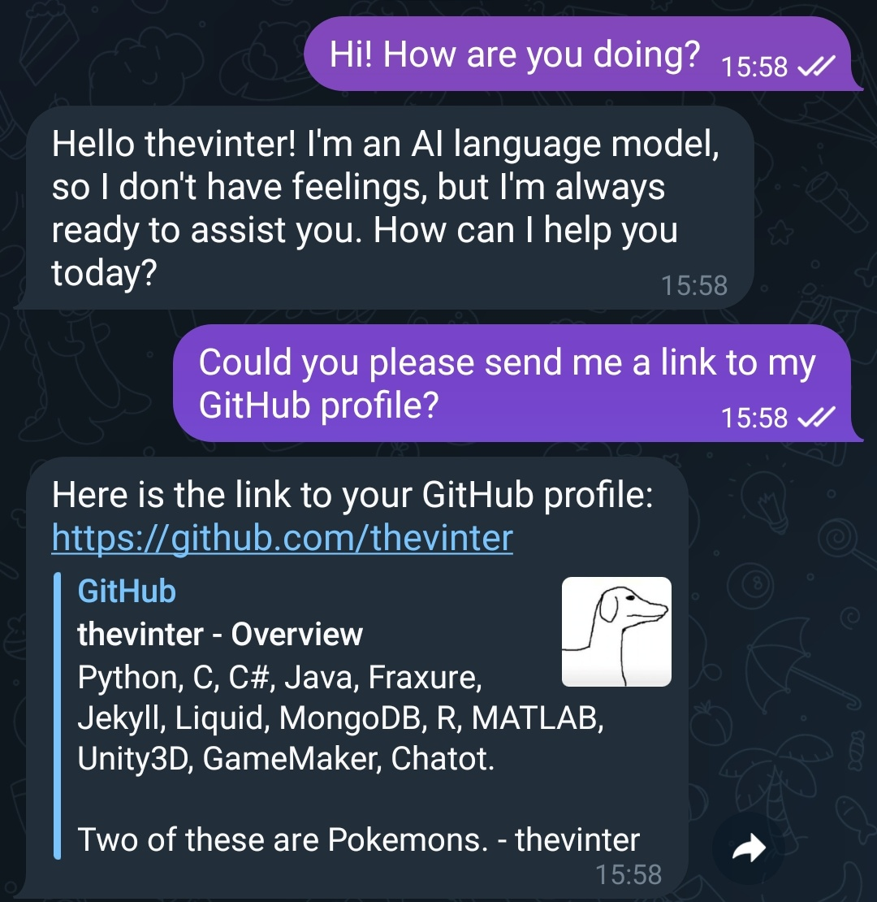

# COTTONTAIL

<p align="center">
  
</p>

Cottontail is a Telegram bot that leverages GPT to provide an AI assistant that can use multiple tools to reply to users in both chat and group contexts and you can easily self-host on your machine.

## Features:

1. Can assess and respond to user inputs in both chat and group contexts.
2. Utilizes multiple tools such as Google Search, WolframAlpha, Python REPL, and Bash.
3. Supports human intervention for tasks that require human input.
4. Conversations and context-awareness capabilities.



## Dependencies:

The program requires external Python libraries:

To install the necessary dependencies, use the following command:

```bash
pip install -r requirements.txt
```

## Configuration:

1. Rename the .env.example file as .env and fill the necessary API keys 

2. Edit the .config file with your information

### Google API Key

Create the GOOGLE_API_KEY in the [Google Cloud credential console](https://console.cloud.google.com/apis/credentials) and a GOOGLE_CSE_ID using the [Programmable Search Engine](https://programmablesearchengine.google.com/controlpanel/create). Next, it is good to follow the Follow [these](https://stackoverflow.com/questions/37083058/programmatically-searching-google-in-python-using-custom-search) instructions 

## Getting Started

Before you can use the AI Assistant Telegram Bot, you need to create a new bot on Telegram and get your unique API key. Follow these steps:

- Open the Telegram app and search for the "BotFather" bot.
- Start a chat with the BotFather and send the following command: /newbot
- Follow the instructions provided by the BotFather to create your new bot. It will ask you to choose a name and a username for your bot.
- After you've successfully created your bot, the BotFather will provide you with your unique bot API key (also known as the bot token). Save this API key, as you will need it to run your AI Assistant Telegram Bot.

## How To Run:

1. Ensure that you have Python 3.7 or later installed.
2. Install the required dependencies.
3. Set up the .env and .config files according to the configuration instructions.
4. Run the bot using the following command:

```bash
python3 main.py
```

## Usage

The mode of interaction differs slightly whether the bot is running in chat or group mode. 

### Chat mode
Just start a new conversation with the bot. Every message sent in private chat to the bot will be parsed as input to the bot. To reply to a question just send another message.

### Group mode
- First you need to add the bot to a group
- Then you need to enable the bot in that specific chat using the `/enable_group` command
- The bot will react only to messages that start with @<botname>. If the "Human Feedback" tool is enabled and the bot asks a question then the reply needs to quote the message containing the question, every other message will be ignored
- To disable the bot for the group use the `/disable_group` command

## Customization:

You can customize the available tools and functionalities by modifying the configuration file .config according to your preferences.

```
botname -> The handle you have to your bot during cration
language -> The language you want your replies to be in
group -> If false then the bot will run in chat mode (see above)
username -> Your handle on Telegram. If in chat mode then the bot will reply only if this matches the one of the one chatting with him. Only this username is allowed to use /enable_group and /disable_group
information -> Some information you'd like the bot to know about you

enable_wolfram -> Enables the integration with Wolfram Alpha for math questions
enable_google -> Enables the integration with Google to allow the bot to search the web

enable_human -> Allows the bot to aks questions back. This is still experimental and doesn't maintain the context of the chat so it might misbehave

### DANGER ZONE ###
### Enable these only if you know EXACTLY what you're doing
enable_python -> Allows the bot to run UNCHECKED python code on the server machine
enable_bash -> Allows the bot to run UNCHECKED bash code on the server machine
### DANGER ZONE ###

system_message -> A system message for the chat mode
group_system_message -> A system message for the group mode
model -> The GPT model you wish to use (gpt-3.5-turbo / gpt-4)
temperature -> A value from 0 to 1 representing the randomness of the replies (The smaller it is, the more deterministic it is)
```
